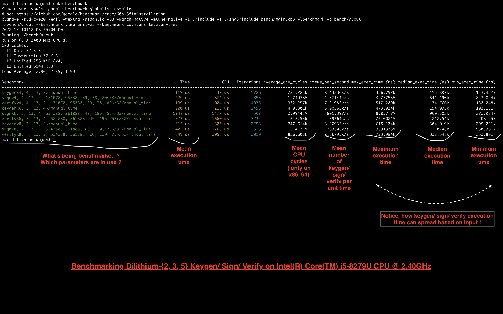

## Benchmarking Dilithium DSA

Benchmarking of Dilithium Digital Signature Algorithm, along with its components, can be done, by issuing

```bash
make benchmark
```

> **Note**

> Benchmarking expects presence of `google-benchmark` library in global namespace ( so that it can be found by the compiler ).

> **Warning**

> CPUs generally have frequency boosting technology, which should be disabled during benchmarking. You may use [this](https://github.com/google/benchmark/blob/60b16f1/docs/user_guide.md#disabling-cpu-frequency-scaling) as your guide.

> **Note** Following screen capture annotates and shows how to interpret Dilithium benchmark results.



### On Intel(R) Core(TM) i5-8279U CPU @ 2.40GHz **[ compiled with Clang ]**

```bash
2022-12-13T12:51:55+04:00
Running ./bench/a.out
Run on (8 X 2400 MHz CPU s)
CPU Caches:
  L1 Data 32 KiB
  L1 Instruction 32 KiB
  L2 Unified 256 KiB (x4)
  L3 Unified 6144 KiB
Load Average: 1.12, 1.34, 1.55
---------------------------------------------------------------------------------------------------------------------------------------------------------------------------------------
Benchmark                                                                Time             CPU   Iterations items_per_second max_exec_time (ns) median_exec_time (ns) min_exec_time (ns)
---------------------------------------------------------------------------------------------------------------------------------------------------------------------------------------
keygen<4, 4, 13, 2>/manual_time                                        119 us          132 us         5744       8.42536k/s           353.784k              115.846k           112.903k
sign<4, 4, 13, 2, 131072, 95232, 39, 78, 80>/32/manual_time            741 us          886 us          933       1.34904k/s           5.17702M              528.992k            248.64k
verify<4, 4, 13, 2, 131072, 95232, 39, 78, 80>/32/manual_time          139 us         1017 us         5061       7.20338k/s           424.655k              134.873k           132.444k
keygen<6, 5, 13, 4>/manual_time                                        200 us          213 us         3506       5.00308k/s            475.78k               195.28k           193.371k
sign<6, 5, 13, 4, 524288, 261888, 49, 196, 55>/32/manual_time         1196 us         1424 us          580        835.936/s           5.53611M              968.291k           366.797k
verify<6, 5, 13, 4, 524288, 261888, 49, 196, 55>/32/manual_time        219 us         1669 us         3195       4.56802k/s           480.611k              213.009k           209.229k
keygen<8, 7, 13, 2>/manual_time                                        309 us          322 us         2220       3.23543k/s           722.719k              304.516k           300.267k
sign<8, 7, 13, 2, 524288, 261888, 60, 120, 75>/32/manual_time         1335 us         1672 us          539        748.983/s           5.27538M              1.10786M           551.567k
verify<8, 7, 13, 2, 524288, 261888, 60, 120, 75>/32/manual_time        346 us         2070 us         2022       2.88783k/s           722.531k              338.482k           334.041k
```

### On ARM Cortex-A72 **[ compiled with GCC ]**

```bash
2022-12-13T08:53:54+00:00
Running ./bench/a.out
Run on (16 X 166.66 MHz CPU s)
CPU Caches:
  L1 Data 32 KiB (x16)
  L1 Instruction 48 KiB (x16)
  L2 Unified 2048 KiB (x4)
Load Average: 0.25, 0.06, 0.02
---------------------------------------------------------------------------------------------------------------------------------------------------------------------------------------
Benchmark                                                                Time             CPU   Iterations items_per_second max_exec_time (ns) median_exec_time (ns) min_exec_time (ns)
---------------------------------------------------------------------------------------------------------------------------------------------------------------------------------------
keygen<4, 4, 13, 2>/manual_time                                        453 us          456 us         1546        2.2091k/s           471.746k              452.294k            449.03k
sign<4, 4, 13, 2, 131072, 95232, 39, 78, 80>/32/manual_time           3929 us         4390 us          172        254.523/s           33.9782M              2.77885M           1.21479M
verify<4, 4, 13, 2, 131072, 95232, 39, 78, 80>/32/manual_time          579 us         4890 us         1208       1.72589k/s           599.775k              578.822k           577.862k
keygen<6, 5, 13, 4>/manual_time                                        734 us          737 us          954       1.36327k/s           755.464k              732.795k           730.323k
sign<6, 5, 13, 4, 524288, 261888, 49, 196, 55>/32/manual_time         6023 us         6765 us          100        166.031/s           25.2453M              5.13823M           1.78759M
verify<6, 5, 13, 4, 524288, 261888, 49, 196, 55>/32/manual_time        890 us         8112 us          786       1.12344k/s           907.924k              889.156k           888.484k
keygen<8, 7, 13, 2>/manual_time                                       1131 us         1135 us          619        884.338/s           1.15001M              1.13023M           1.12471M
sign<8, 7, 13, 2, 524288, 261888, 60, 120, 75>/32/manual_time         7096 us         8234 us          108        140.928/s           25.8751M              5.68788M           2.57579M
verify<8, 7, 13, 2, 524288, 261888, 60, 120, 75>/32/manual_time       1359 us         9547 us          515        735.984/s           1.37369M               1.3573M            1.3564M
```

### On ARM Cortex-A72 **[ compiled with Clang ]**

```bash
2022-12-13T08:58:27+00:00
Running ./bench/a.out
Run on (16 X 166.66 MHz CPU s)
CPU Caches:
  L1 Data 32 KiB (x16)
  L1 Instruction 48 KiB (x16)
  L2 Unified 2048 KiB (x4)
Load Average: 0.61, 0.47, 0.21
---------------------------------------------------------------------------------------------------------------------------------------------------------------------------------------
Benchmark                                                                Time             CPU   Iterations items_per_second max_exec_time (ns) median_exec_time (ns) min_exec_time (ns)
---------------------------------------------------------------------------------------------------------------------------------------------------------------------------------------
keygen<4, 4, 13, 2>/manual_time                                        381 us          385 us         1836        2.6236k/s           389.558k              380.822k           376.574k
sign<4, 4, 13, 2, 131072, 95232, 39, 78, 80>/32/manual_time           2979 us         3370 us          263        335.725/s           12.0187M              2.19145M           962.368k
verify<4, 4, 13, 2, 131072, 95232, 39, 78, 80>/32/manual_time          462 us         3877 us         1515       2.16414k/s           479.427k              461.391k           460.575k
keygen<6, 5, 13, 4>/manual_time                                        622 us          626 us         1125       1.60726k/s           640.215k              621.471k           619.935k
sign<6, 5, 13, 4, 524288, 261888, 49, 196, 55>/32/manual_time         5081 us         5712 us          140        196.827/s           21.5209M              3.17209M            1.4192M
verify<6, 5, 13, 4, 524288, 261888, 49, 196, 55>/32/manual_time        720 us         6378 us          973       1.38933k/s           736.912k              718.683k           718.012k
keygen<8, 7, 13, 2>/manual_time                                        968 us          972 us          723        1032.91/s           977.032k              967.781k           961.204k
sign<8, 7, 13, 2, 524288, 261888, 60, 120, 75>/32/manual_time         5794 us         6772 us          125        172.593/s           22.7012M               4.4919M           2.06119M
verify<8, 7, 13, 2, 524288, 261888, 60, 120, 75>/32/manual_time       1108 us         7722 us          631        902.193/s           1.12773M              1.10712M           1.10585M
```

### On ARM Neoverse-V1 **[ compiled with GCC ]**

```bash
2022-12-10T14:03:38+00:00
Running ./bench/a.out
Run on (64 X 2100 MHz CPU s)
CPU Caches:
  L1 Data 64 KiB (x64)
  L1 Instruction 64 KiB (x64)
  L2 Unified 1024 KiB (x64)
  L3 Unified 32768 KiB (x1)
Load Average: 0.33, 0.09, 0.03
---------------------------------------------------------------------------------------------------------------------------------------------------------------------------------------
Benchmark                                                                Time             CPU   Iterations items_per_second max_exec_time (ns) median_exec_time (ns) min_exec_time (ns)
---------------------------------------------------------------------------------------------------------------------------------------------------------------------------------------
keygen<4, 4, 13, 2>/manual_time                                        148 us          150 us         4715       6.73746k/s           159.589k              148.222k           146.119k
sign<4, 4, 13, 2, 131072, 95232, 39, 78, 80>/32/manual_time            846 us          996 us          898       1.18202k/s           4.47619M              615.749k           290.894k
verify<4, 4, 13, 2, 131072, 95232, 39, 78, 80>/32/manual_time          167 us         1165 us         4186       5.97836k/s           182.236k              166.938k           166.068k
keygen<6, 5, 13, 4>/manual_time                                        251 us          252 us         2790       3.98626k/s           260.158k              250.377k            248.72k
sign<6, 5, 13, 4, 524288, 261888, 49, 196, 55>/32/manual_time         1353 us         1608 us          547        739.283/s           7.74467M              1.12579M             442.1k
verify<6, 5, 13, 4, 524288, 261888, 49, 196, 55>/32/manual_time        269 us         1912 us         2598       3.71141k/s           279.115k               268.98k           268.204k
keygen<8, 7, 13, 2>/manual_time                                        408 us          409 us         1716       2.45178k/s            414.05k               407.46k           404.426k
sign<8, 7, 13, 2, 524288, 261888, 60, 120, 75>/32/manual_time         1517 us         1932 us          410        659.062/s           6.96834M              1.30627M           677.523k
verify<8, 7, 13, 2, 524288, 261888, 60, 120, 75>/32/manual_time        438 us         2473 us         1599       2.28536k/s           443.934k              436.902k           435.677k
```

### On ARM Neoverse-V1 **[ compiled with Clang ]**

```bash
2022-12-10T14:04:37+00:00
Running ./bench/a.out
Run on (64 X 2100 MHz CPU s)
CPU Caches:
  L1 Data 64 KiB (x64)
  L1 Instruction 64 KiB (x64)
  L2 Unified 1024 KiB (x64)
  L3 Unified 32768 KiB (x1)
Load Average: 0.47, 0.18, 0.07
---------------------------------------------------------------------------------------------------------------------------------------------------------------------------------------
Benchmark                                                                Time             CPU   Iterations items_per_second max_exec_time (ns) median_exec_time (ns) min_exec_time (ns)
---------------------------------------------------------------------------------------------------------------------------------------------------------------------------------------
keygen<4, 4, 13, 2>/manual_time                                        197 us          199 us         3546       5.06428k/s            203.65k              197.218k            194.84k
sign<4, 4, 13, 2, 131072, 95232, 39, 78, 80>/32/manual_time           1606 us         1807 us          404        622.569/s           9.43351M              1.21882M           531.318k
verify<4, 4, 13, 2, 131072, 95232, 39, 78, 80>/32/manual_time          246 us         2148 us         2848       4.06927k/s            252.37k              245.361k            244.56k
keygen<6, 5, 13, 4>/manual_time                                        327 us          329 us         2141       3.05735k/s            337.32k              326.605k           325.233k
sign<6, 5, 13, 4, 524288, 261888, 49, 196, 55>/32/manual_time         2638 us         2968 us          242        379.127/s           10.5144M              2.15801M           764.136k
verify<6, 5, 13, 4, 524288, 261888, 49, 196, 55>/32/manual_time        377 us         3325 us         1857        2.6524k/s           388.282k              376.423k           375.206k
keygen<8, 7, 13, 2>/manual_time                                        506 us          508 us         1383       1.97598k/s           513.194k              505.544k           502.862k
sign<8, 7, 13, 2, 524288, 261888, 60, 120, 75>/32/manual_time         2848 us         3357 us          250        351.136/s           11.9661M              2.38615M           1.10869M
verify<8, 7, 13, 2, 524288, 261888, 60, 120, 75>/32/manual_time        583 us         4209 us         1201       1.71498k/s           593.927k              582.183k           581.076k
```

### On Intel(R) Xeon(R) CPU E5-2686 v4 @ 2.30GHz **[ compiled with GCC ]**

```bash
2022-12-13T09:00:59+00:00
Running ./bench/a.out
Run on (4 X 2300.25 MHz CPU s)
CPU Caches:
  L1 Data 32 KiB (x2)
  L1 Instruction 32 KiB (x2)
  L2 Unified 256 KiB (x2)
  L3 Unified 46080 KiB (x1)
Load Average: 0.19, 0.05, 0.01
---------------------------------------------------------------------------------------------------------------------------------------------------------------------------------------
Benchmark                                                                Time             CPU   Iterations items_per_second max_exec_time (ns) median_exec_time (ns) min_exec_time (ns)
---------------------------------------------------------------------------------------------------------------------------------------------------------------------------------------
keygen<4, 4, 13, 2>/manual_time                                        247 us          252 us         2835       4.04174k/s           282.834k              246.174k           242.486k
sign<4, 4, 13, 2, 131072, 95232, 39, 78, 80>/32/manual_time           1538 us         1793 us          439        650.193/s           7.57288M              1.14331M           530.262k
verify<4, 4, 13, 2, 131072, 95232, 39, 78, 80>/32/manual_time          286 us         2132 us         2439       3.49233k/s           318.087k              285.402k           284.451k
keygen<6, 5, 13, 4>/manual_time                                        417 us          422 us         1679       2.39747k/s           531.545k              415.433k           413.852k
sign<6, 5, 13, 4, 524288, 261888, 49, 196, 55>/32/manual_time         2758 us         3183 us          277        362.602/s           12.0708M              2.09614M           799.092k
verify<6, 5, 13, 4, 524288, 261888, 49, 196, 55>/32/manual_time        459 us         3481 us         1525       2.17703k/s           551.563k              457.531k           456.341k
keygen<8, 7, 13, 2>/manual_time                                        673 us          677 us         1041       1.48658k/s           734.374k              670.679k           665.915k
sign<8, 7, 13, 2, 524288, 261888, 60, 120, 75>/32/manual_time         2875 us         3557 us          243        347.796/s           11.2358M              2.38248M           1.19656M
verify<8, 7, 13, 2, 524288, 261888, 60, 120, 75>/32/manual_time        735 us         4393 us          953       1.35969k/s           1059.66k              732.159k           730.732k
```

### On Intel(R) Xeon(R) CPU E5-2686 v4 @ 2.30GHz **[ compiled with Clang ]**

```bash
2022-12-13T09:02:25+00:00
Running ./bench/a.out
Run on (4 X 2300.25 MHz CPU s)
CPU Caches:
  L1 Data 32 KiB (x2)
  L1 Instruction 32 KiB (x2)
  L2 Unified 256 KiB (x2)
  L3 Unified 46080 KiB (x1)
Load Average: 0.38, 0.15, 0.05
---------------------------------------------------------------------------------------------------------------------------------------------------------------------------------------
Benchmark                                                                Time             CPU   Iterations items_per_second max_exec_time (ns) median_exec_time (ns) min_exec_time (ns)
---------------------------------------------------------------------------------------------------------------------------------------------------------------------------------------
keygen<4, 4, 13, 2>/manual_time                                        179 us          184 us         3901       5.57853k/s           237.569k              178.732k           175.492k
sign<4, 4, 13, 2, 131072, 95232, 39, 78, 80>/32/manual_time           1202 us         1390 us          596        832.049/s           9.38855M              900.419k           417.351k
verify<4, 4, 13, 2, 131072, 95232, 39, 78, 80>/32/manual_time          217 us         1657 us         3222       4.61372k/s           280.692k              215.844k           214.818k
keygen<6, 5, 13, 4>/manual_time                                        303 us          308 us         2308       3.29981k/s            345.24k              302.051k           300.074k
sign<6, 5, 13, 4, 524288, 261888, 49, 196, 55>/32/manual_time         1915 us         2227 us          400        522.105/s           15.3144M              1.64067M           620.165k
verify<6, 5, 13, 4, 524288, 261888, 49, 196, 55>/32/manual_time        338 us         2651 us         2069       2.95721k/s           399.542k              336.767k           335.838k
keygen<8, 7, 13, 2>/manual_time                                        471 us          476 us         1485       2.12241k/s           530.118k              469.892k            466.25k
sign<8, 7, 13, 2, 524288, 261888, 60, 120, 75>/32/manual_time         2340 us         2821 us          320        427.348/s           8.87587M              1.85381M           915.563k
verify<8, 7, 13, 2, 524288, 261888, 60, 120, 75>/32/manual_time        534 us         3277 us         1313       1.87396k/s           592.434k              531.645k           529.845k
```

### On Intel(R) Xeon(R) Platinum 8375C CPU @ 2.90GHz **[ compiled with GCC ]**

```bash
2022-12-13T09:04:04+00:00
Running ./bench/a.out
Run on (128 X 1269.58 MHz CPU s)
CPU Caches:
  L1 Data 48 KiB (x64)
  L1 Instruction 32 KiB (x64)
  L2 Unified 1280 KiB (x64)
  L3 Unified 55296 KiB (x2)
Load Average: 0.00, 0.00, 0.02
---------------------------------------------------------------------------------------------------------------------------------------------------------------------------------------
Benchmark                                                                Time             CPU   Iterations items_per_second max_exec_time (ns) median_exec_time (ns) min_exec_time (ns)
---------------------------------------------------------------------------------------------------------------------------------------------------------------------------------------
keygen<4, 4, 13, 2>/manual_time                                        141 us          142 us         4973        7.1012k/s           146.569k              140.836k           137.632k
sign<4, 4, 13, 2, 131072, 95232, 39, 78, 80>/32/manual_time           1044 us         1187 us          722        958.288/s           5.82347M              744.469k           351.787k
verify<4, 4, 13, 2, 131072, 95232, 39, 78, 80>/32/manual_time          179 us         1314 us         3917       5.59679k/s           183.958k              178.686k           176.932k
keygen<6, 5, 13, 4>/manual_time                                        232 us          233 us         3019       4.31268k/s           247.294k              231.833k           228.838k
sign<6, 5, 13, 4, 524288, 261888, 49, 196, 55>/32/manual_time         1706 us         1940 us          408        586.045/s            9.8103M              1.34086M           519.595k
verify<6, 5, 13, 4, 524288, 261888, 49, 196, 55>/32/manual_time        276 us         2208 us         2537       3.62261k/s           288.486k              276.208k           271.423k
keygen<8, 7, 13, 2>/manual_time                                        360 us          361 us         1946        2.7813k/s           374.002k              359.752k           353.957k
sign<8, 7, 13, 2, 524288, 261888, 60, 120, 75>/32/manual_time         1773 us         2135 us          348         563.96/s           7.10302M              1.13412M           754.064k
verify<8, 7, 13, 2, 524288, 261888, 60, 120, 75>/32/manual_time        427 us         2651 us         1641       2.34386k/s           449.158k              426.966k           420.997k
```

### On Intel(R) Xeon(R) Platinum 8375C CPU @ 2.90GHz **[ compiled with Clang ]**

```bash
2022-12-13T09:05:59+00:00
Running ./bench/a.out
Run on (128 X 1266.84 MHz CPU s)
CPU Caches:
  L1 Data 48 KiB (x64)
  L1 Instruction 32 KiB (x64)
  L2 Unified 1280 KiB (x64)
  L3 Unified 55296 KiB (x2)
Load Average: 0.17, 0.09, 0.05
---------------------------------------------------------------------------------------------------------------------------------------------------------------------------------------
Benchmark                                                                Time             CPU   Iterations items_per_second max_exec_time (ns) median_exec_time (ns) min_exec_time (ns)
---------------------------------------------------------------------------------------------------------------------------------------------------------------------------------------
keygen<4, 4, 13, 2>/manual_time                                        109 us          110 us         6447       9.21105k/s           114.138k              108.562k           106.485k
sign<4, 4, 13, 2, 131072, 95232, 39, 78, 80>/32/manual_time            731 us          842 us         1003       1.36833k/s           6.38186M              512.551k           238.235k
verify<4, 4, 13, 2, 131072, 95232, 39, 78, 80>/32/manual_time          128 us          943 us         5480       7.82679k/s           192.722k              127.666k           126.609k
keygen<6, 5, 13, 4>/manual_time                                        192 us          193 us         3653       5.21715k/s           200.249k               191.64k           190.169k
sign<6, 5, 13, 4, 524288, 261888, 49, 196, 55>/32/manual_time         1189 us         1383 us          649        841.176/s           6.73003M              938.524k           358.424k
verify<6, 5, 13, 4, 524288, 261888, 49, 196, 55>/32/manual_time        202 us         1553 us         3461       4.94309k/s           298.414k              202.143k           200.947k
keygen<8, 7, 13, 2>/manual_time                                        292 us          293 us         2396       3.42328k/s           310.737k               292.08k           289.236k
sign<8, 7, 13, 2, 524288, 261888, 60, 120, 75>/32/manual_time         1336 us         1631 us          548        748.313/s           7.16035M              1066.76k           535.434k
verify<8, 7, 13, 2, 524288, 261888, 60, 120, 75>/32/manual_time        324 us         1904 us         2162         3.087k/s           464.722k              323.699k           321.837k
```
